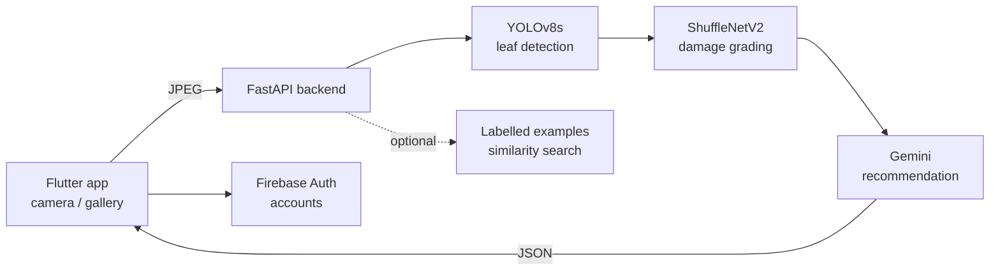

# CropEye

**Mobile app for tomato leaves, focused on the tomato leafminer (*Tuta absoluta*). It grades leaf damage from the
camera and gives advice in Arabic or English.**

> **Status: under development.** The hosted backend is offline, so the published app cannot scan right now.
> The backend runs locally (instructions below); the app opens in an offline mode when the server is not reachable.


## What it does

1. **Detect** – a YOLOv8s model (ONNX) finds leaves in the camera frame.
2. **Grade** – a ShuffleNetV2 classifier (ONNX) grades the damage: healthy, mild, moderate or severe.
3. **Advise** – Google Gemini writes a short recommendation for the result, and a chat assistant answers
   follow-up questions in Arabic or English (detected from the message).

In live camera mode, boxes and grades are smoothed across consecutive frames. An optional database of labelled
examples (`leaf_index.pkl`) can refine the grade by similarity search.



## Repository layout

```
lib/                    Flutter app (screens, camera page, chat page, settings)
  cloud_service.dart    the only place that talks to the backend
backend/
  cropeye_fastapi.py    FastAPI service: /detect, /detect_base64, /chat, /healthz, /ping, /warmup
  models/               put the ONNX model files here (not in the repo - see models/README.md)
  .env.example          every backend setting, with defaults
  Dockerfile            CUDA 11.8 image used on Google Cloud Run (GPU)
assets/                 app images
android/ ios/ web/ linux/ macos/ windows/   Flutter platform projects
```

## Run it locally

### 1. Backend

```bash
cd backend
python -m venv .venv && source .venv/bin/activate        # Windows: .venv\Scripts\activate
pip install -r requirements.txt onnxruntime                # or onnxruntime-gpu with CUDA
# put best_yolo_s.onnx and shufflenetv2_full_precision.onnx in backend/models/
export GEMINI_API_KEY=...                                  # optional: enables the advice and the chat
export ALLOW_IDLE_EXIT=0                                   # keep the server running while you work
uvicorn cropeye_fastapi:app --host 0.0.0.0 --port 8000
```

Check it: `http://127.0.0.1:8000/healthz` shows whether both models loaded.
All settings are environment variables, listed in [`backend/.env.example`](backend/.env.example).
Diagnostic routes (`/debug/...`, `/docs`) are hidden unless `ENABLE_DEBUG_ROUTES=1`; keep them off on any public server.

Docker (GPU): `docker build -t cropeye-backend backend && docker run --gpus all -p 8080:8080 --env-file backend/.env cropeye-backend`

### 2. App

```bash
flutter pub get
flutter run                                                         # backend on this machine (desktop, web, iOS simulator)
flutter run --dart-define=CROPEYE_API_URL=http://10.0.2.2:8000      # Android emulator
flutter run --dart-define=CROPEYE_API_URL=http://192.168.1.5:8000   # phone on the same Wi-Fi (use your PC's IP)
```

The backend address is a build-time setting (`CROPEYE_API_URL`), so no code changes are needed between devices.
If the server cannot be reached the app shows **AI service offline** with *Retry* and *Continue offline*.

Sign-in uses Firebase Authentication. To use your own Firebase project, run `flutterfire configure`, which
regenerates `lib/firebase_options.dart` and `android/app/google-services.json`. (Firebase client keys identify a
project rather than grant access; restrict the key to your app in Google Cloud Console.)

## Roadmap

- [ ] Bring the hosted backend back online
- [ ] Migrate from `google-generativeai` (end of life) to the `google-genai` SDK
- [ ] Offline-first mode: cache scans locally and sync when back online
- [ ] Geotag scans to map how a disease spreads across a farm
- [ ] On-device inference for the severity model
- [ ] Clean up the remaining analyzer warnings (deprecated `withOpacity`, async `BuildContext` use)
- [ ] Longer term: a field rover that uses the detections for targeted treatment

## Author

**Mohammad Kamal Abdulaziz** - [GitHub](https://github.com/Mohammad-Kamal23) · [LinkedIn](https://www.linkedin.com/in/mohammadabdulaziz23) · moh203.kamal@gmail.com

## License

[MIT](LICENSE)
